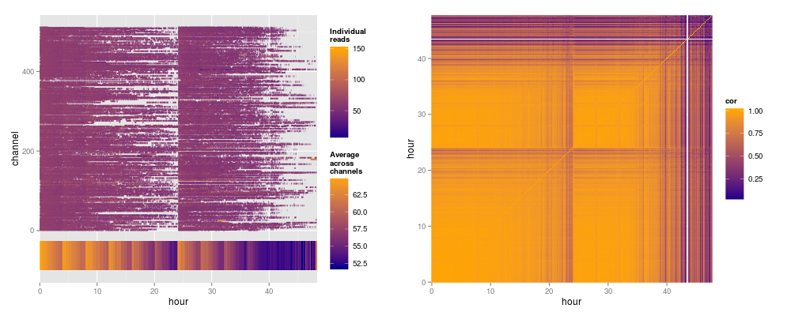

```{r style, echo = FALSE, results = 'asis'}
BiocStyle::markdown()
knitr::opts_chunk$set(eval=TRUE)
```

# Introduction

This package is intended to provide tools for the quality assessment of data produced by Oxford Nanopore's MinION sequencer.  It includes a functions to generate a number plots for examining the statistics that we think will be useful for this task.

However, nanopore sequencing is an emerging and rapidly developing technology.  It is not clear what will be most informative.  We hope that `IONiseR` will provide a framework for visualisation of metrics that we haven't thought of, and welcome feedback at mike.smith@embl.de.

If you're not interested in the quality assement of the raw or event level data, and want to jump straight to the getting FASTQ format files from fast5 files you can go straight to the final section of this document.

## Getting started

In order to get started we need to load the `IONiseR` library.  In addition also load `ggplot2` and `gridExtra`, which are useful for arranging the plots in this vignette, but they are not essential to using the package.

```{r loadLibs, message=FALSE, warning=FALSE}
library(IONiseR)
library(ggplot2)
library(gridExtra)
```

# Reading data

Once the libraries are loaded we need to read some data.  We do this using the function `readFast5Summary()`.  This function takes a vector containing the path names of fast5 files you'd like to read.  The example below looks in a specific folder and selects all of the files whose name ends with ".fast5".  We then pass this list of files to the reading function.

*You should replace "/path/to/data" with the location of your fast5 files*.

```{r readData, eval=FALSE}
fast5files <- list.files(path = "/path/to/data/", pattern = ".fast5$", full.names = TRUE)
example.summary <- readFast5Summary( fast5files )
```

Raw fast5 data isn't distributed with this package, but example of the summarised format can found in the accompanying `minionSummaryData` package.  The following command will load this data, giving us an object called `s.typhi.rep1`.  If you have your own MinION data you wish to work with you should ignore this section of code and modify the example above to read your own files.

*The data presented in this example are taken from the publication by Ashton* et al *[@ashton2015minion]. You can obtain the original data from the European Nucleotide Archive here: http://www.ebi.ac.uk/ena/data/view/ERR668747*

```{r loadData}
library(minionSummaryData)
data(s.typhi.rep1)
```

Typing the name of the resulting object will print a short summary of its contents to the screen.

```{r exampleData}
s.typhi.rep1
```

## The `Fast5Summary` class

The `s.typhi.rep1` object is an example of a the `Fast5Summary` class.  

The structure of the class tries to reflect the variety of data one can find in fast5 files.  Depending upon the quality of the data basecalling may not be successful resulting in fast5 files that are essentially empty or files that contain event information but no called bases.  More commonly, basecalling is successful to some extent, but there is still a range of possibilities including files with only a template strand called, files with template and complement strands of differening lengths, and ideally files with well matched template and complement strands, plus a consensus 2D read.

*It is possible to read fast5 files that have not been basecalled, but since in most cases uploading to the Metrichor basecaller is performed automatically, it is unlikely that this will be a common usecase.*

The `Fast5Summary` class has four slots, each of which is designed to store data relating to one level of processing described above. The data themselves are stored as either as a `data.frame` or a `ShortReadQ`, one per slot. The table below gives the names of the four slots, along with a description of stage within the base calling process this represents and the specific fields that are currently stored in the appropriate `data.frame`. 

  Fast5Summary-class 
  -------------------------
  **readInfo** - All fast5 files contain this level of information 
  File name, channel, mux, pass/fail status
  **eventData** - If events were recorded this level is populated 
  Mean signal, start time, duration, no. of events 
  **baseCalled** - Created if base calling succeeded. Separate entries for each strand 
  Start time, duration, no. of events, strand, 2D status 
  **fastq** - Up to three entries per file (template, complement and 2D reads) 
  Bases and qualities 


### Extracting data

Data in the four slots can be obtained using the appropriate accessor methods: `readInfo()`, `eventData()`, `baseCalled()` and `fastq()`.  The example below extracts the base called from our example object.

```{r extractData1, warning=FALSE}
baseCalled(s.typhi.rep1)
```

### Subsetting

Since the the number of entries in each slot can be different between a specific reads, the `id` column is present in all entires corresponds to the fast5 file data was read from.  Subsetting operations work relative to this `id` field, so all data from the selected files is retained.  In the example below we select two files and can see that both the template and complement read information is retained in the `baseCalled` slot.

```{r extractData2, warning=FALSE}
baseCalled(s.typhi.rep1[1:2])
```

# Summary plots

## Data production

Once data have been read into a summary object `IONiseR` contains a number of functions for plotting the data.  The first example below visualises the accumulation of reads over the run time.  The second plot shows the how many channels were active (i.e. the number of molecules being read) during each minute of the experiment.

```{r summaryPlots1, fig.height=5, fig.width=12.5, dev='png', warning=FALSE}
p1 <- plotReadAccumulation(s.typhi.rep1)
p2 <- plotActiveChannels(s.typhi.rep1)
grid.arrange(p1, p2, ncol = 2)
```

## Read types

We may also be interested in the proportion of reads types that were generated.  Ideally, Oxford Nanopore's sequencing technology works by reading both the template and complement strands of a double-stranded DNA molecule.  The readings from both strands are then combined to give a higher confidence consensus sequence for the whole fragment - referred to as a 2D read.  

Given the nature of this process, there is a strict hierarchy to the data that can be found in a fast5 file. A full 2D read requires both a complement and template strand to have been read correctly. Similarly, a complement strand can only be present if the template was read successfully. Finally, you can encounter a file containing no called bases on either strand.

The function `plotReadCategories()` will visualise the total number of fast5 files summarised in an `Fast5Summary` object, along with the counts of those containing template, complement and 2D calls.  For an ideal dataset all four bars will be the same height, and the difference between them can reflect the quality of a dataset.  These values are the same as those printed out when typing in the name of a summary data object.

It may also be interesting to examine the base quality scores for the reads in the three categories.  The function `plotReadCategoryQuals()` allows one to do this, calculating the mean quality score for each sequence.

```{r readCategories, fig.height=5, fig.width=12.5, dev='svg', warning=FALSE}
p1 <- plotReadCategoryCounts(s.typhi.rep1)
p2 <- plotReadCategoryQuals(s.typhi.rep1)
grid.arrange(p1, p2, ncol = 2)
```

## Reading rates

We can also look the performance of the pores over time.  For example, we may be interested in how rapidly events occur, which should be analagous to the rate at which molecules move through the nanopores.  The function `plotEventRate()` visualises this.

In similar fashion, we can also look at the rate at which actual nucleotide bases are called changes over time using `plotBaseProductionRate()`.  One would expect this to be closely related to the event rate (since each event should correspond to a base moving through the pore), however it is possible to envisage an scenario where events are recorded, but for some reason the base caller struggles to interpret them.

```{r summaryPlots2, fig.height=5, fig.width=12.5, dev='png', warning=FALSE}
p1 <- plotEventRate(s.typhi.rep1)
p2 <- plotBaseProductionRate(s.typhi.rep1)
grid.arrange(p1, p2, ncol = 2)
```

# Layout plots

When considering channel related metrics we can plot them as they are laid out on the flow cell.  To create plots of this form we can use the function `layoutPlot()`.  
```{r numReads, fig.height=4.8, fig.width=14.5, dev='svg', warning=FALSE}
p1 <- layoutPlot(s.typhi.rep1, attribute = "nreads")
p2 <- layoutPlot(s.typhi.rep1, attribute = "kb")
grid.arrange(p1, p2, ncol = 2)
```

The `attribute` argument currently takes three possible values: "nreads", "kb" or "signal" which will respectively plot the total number of reads, the cumulative number of bases read by a channel, and the median signal recorded by the pore.  

## Plotting alternative metrics

If you wish to map a different metric on to the channel layout you can use the fuction `channelHeatmap()`.  This function requires a data.frame as input, with one column called 'channel'.  You can then use to the argument `zValue` to specify the intensity with which each channel is plotted.  

To demonstrate this, in the example below we will plot both the number of full 2D reads produced by each channel, and the proportion of all reads from the channel that are 2D.  When retrieving data from the `Fast5Summary`  object, each slot is returned as a `data.table`, allowing us to use `dplyr` and its associated pipe paradigm to manipulate the data. 

```{r heatmapExample, fig.height=4.8, fig.width=14.5, dev='svg', message=FALSE, warning=FALSE}
library(dplyr)

read_count_2D <- baseCalled(s.typhi.rep1) %>% ## start with base called reads
  filter(strand == 'template') %>% ## keep template so we don't count things twice
  left_join(readInfo(s.typhi.rep1), by = 'id') %>% ## channel stored in @readInfo slot, match by id column
  group_by(channel) %>% ## group according to channel
  summarise(d2_count = length(which(full_2D == TRUE)), ## count those with full 2D status
            d2_prop = length(which(full_2D == TRUE)) / n()) ## divide by total count of reads from channel

## plot side-by-side
p1 <- channelHeatmap(read_count_2D, zValue = 'd2_count')
p2 <- channelHeatmap(read_count_2D, zValue = 'd2_prop')
grid.arrange(p1, p2, ncol = 2)
```

# Plotting against channel and time

If we want to look at the patterns that affect specific channels, or all channels for specific periods of time, we can use the function `channelActivityPlot()`.  By default this will plot a for every FAST5 file, sorted by channel on the y-axis and the time of the first and last recorded events on the x-axis.  

If provided with a `zScale` argument each line will be colored according to the specified data.  `zScale` expects to be passed a data.frame containing the id of a read, and a column containing the metric of interest.  In the example below we extract the id and median_signal columns from a Fast5Summary object.

```{r channelActivity, fig.height=4.8, fig.width=10, dev='png', message=FALSE, warning=FALSE}
data(s.typhi.rep3, package = 'minionSummaryData')
## we will plot the median event signal for each read on z-axis
z_scale = select(eventData(s.typhi.rep3), id, median_signal)
channelActivityPlot( s.typhi.rep3, zScale = z_scale )
```

Small numbers of reads with extreme values can compress the colours on the z-axis.  To make time related patterns easier to pick out reads across all channels are grouped by the starting time, and the mean value for all reads in the group is calculated and shown along the bottom of the plot.

# Pentamer content

Given that the sequence of a read is inferred from the recorded signal, one might wish to see if fluctuations in current over time are reflected in the base content of the reads produced.  The function `plotKmerFrequencyCorrelation()` breaks reads into groups by the time the read was first entered a pore.  The distribution of kmer (defaults to pentamers, but can be specified using the `kmerLength` argument) frequencies is then calculated for each window.  The correlation between each window and all others is then plotted, allowing one to see if the kmer content alters during run time.  The argument `only2D` switches between using the recorded template and complement strands, or the consensus 2D sequence.

```{r pentamerCorrelation, fig.height=5, fig.width=6.5, dev='png', message=FALSE, warning=FALSE}
plotKmerFrequencyCorrelation( s.typhi.rep3, only2D = FALSE )
```

The data included in `minionSummaryData` are very early in the life span of the MinION device, with a relatively smaller number of reads produced by only a few channels.  The following plots are created using a more recent, but currently unpublished, set of data.  Distinct waves in the average signal can be seen, although this doesn't seem to greatly impact the pentamer content of the resulting reads.

```{r combinedplots, eval=FALSE}
p1 <- channelActivityPlot(dat, select(eventData(dat), id, median_signal))
p2 <- plotKmerFrequencyCorrelation(dat)
grid.arrange(p1, p2, ncol = 2)
```



# Extracting reads

If you wish to write reads out to a FASTQ file there are two option you can use, depending upon whether you have used some of the previous quality assessment step, or simply want to go straight to the FASTQ files without looking at any of the other metrics.

## Writing from `Fast5Summary` object

If you already created a `Fast5Summary` object for your files, this contains the FASTQ entries and you can use the `writeFastq()` function from the `ShortRead` package to write them to disk, as shown here:

```{r writefastq, message=FALSE}
library(ShortRead)
writeFastq( fastq( s.typhi.rep1 ), file = tempfile() )
```

`IONiseR` also includes shortcut accessor functions for extracting the fastq entries for only the template (`fastqTemplate()`), complement (`fastqComplement()`) or 2D (`fastq2D()`) reads.  You can use these to extract and write out only the subset of reads you are intested in.  The example below will save only the 2D reads to a file.

```{r writefastq2}
writeFastq( fastq2D( s.typhi.rep1 ), file = tempfile() )
```

## Obtaining FASTQ directly from fast5

If you aren't interested in the quality control metrics, or have already assessed them, it is quicker to extract the FASTQ files directly and ignore the other data in the fast5 files.  You can do this using the function `fast5toFastq()`.  In the example shown here we work on a single fast5 file provided with the package, however you can provide a vector file names to the `files` argument and the FASTQ entries found in all of them will be combined together.

`fast5toFastq()` takes a number of additional arguments.  `fileName` provides a common stem for the created FASTQ files, while `outputDir()` defines the location the new files will be created in.  You can use `strand` to define which strands you want to extract and can take any combination of the options: *"template", "complement", "2D", "all"* and *"both"*.  The default is *"all"*, which will give you everything available. If you want only the template and complement strands you can use *both* or specify them explicitly.  `ncores` lets you specify the number of CPU cores to be used during the extraction.  This can potentially speed up this operation, but in my experience this seems to be more IO bound than CPU, so there is little benefit achieved by using a high number of cores.

The final command below lists the files that have been created by the `fast5toFastq()`  You can see that we have created three files, each of which start with the text given to the `fileName` argument and then the appropriate strand is appended to the name.

```{r fast5toFastq}
fast5files <- system.file('extdata', 'example.fast5', package = "IONiseR")
fast5toFastq(files = fast5files, fileName = "test", outputDir = tempdir(), 
             strand = 'all', ncores = 1)
list.files(path = tempdir(), pattern = "*.fq.gz$")
```

# References
